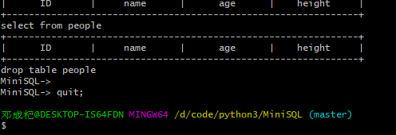

# <center>MiniSQL设计总报告</center>

## 一、MiniSQL总体框架

### 1.1 MiniSQL实现功能分析

- 总功能：作为一个精简型单用户SQL引擎(DBMS)MiniSQL，允许用户通过字符界面输入SQL语句实现表的建立/删除；索引的建立/删除以及表记录的插入/删除/查找。
- 支持数据类型：整形int、浮点数float和字符串char(n)，其中char(n)满足 1<=n<=255。
- 表定义：一个表最多可以定义32个属性，各属性可以指定是否为unique；支持单属性的主键定义。
- 索引的建立和删除：对于表的主属性自动建立B+树索引，对于声明为unique的属性可以通过SQL语句由用户指定建立/删除B+树索引（因此，所有的B+树索引都是单属性单值的）。
- 查找记录：可以通过指定用and连接的多个条件进行查询，支持等值查询和区间查询 。
- 插入和删除记录：支持每次一条记录的插入操作；支持每次一条或多条记录的删除操作 。

### 1.2 MiniSQL系统体系架构


### 1.3 设计语言和运行环境

- 设计语言：Python3.6
- 运行环境：WIndows10 、Ubuntu16.4

## 二、MiniSQL各模块实现功能

### 2.1 Interpreter


- 负责与用户的交互部分，它为用户提供一个简单的命令行界面，允许用户在命令行中输入SQL语句，MiniSQL会执行语句并返回执行的结果。
- 对输入的语句进行分析，粗略的解析语句并调用对应的API函数进行执行，对返回的结果在命令行进行标准化的打印。
- 捕捉其他模块抛出的异常，在命令行中显示错误信息。

### 2.2 API

- **信息提取**

API模块会对SQL语句进行详细的解析，把语句包含的信息进行提取，传入Record或者Catalog模块中。例如，对于

```python 
insert into student (316010XXXX, 'chen', 20, 184.5);
```
API模块会在这条SQL语句中提取出`table`、`ID`、`name`、`age`、`height`对应的信息，然后调用相关的record或者catalog模块中的接口，执行SQL语句

- **检查语法错误**

检查SQL语句是否符合标准语法，如果存在错误则抛出`MiniSQLSyntaxError`异常，异常由Interpreter模块负责处理。一般的语法错误不会中断程序，而会在命令行界面上显示出来，提醒用户语句存在语法错误。

- **清空数据库**

为了方便程序进行调试、测试，额外增加了一个clear伪SQL语句，执行clear会清楚数据库内所有数据

### 2.3 Catalog Manager

Catalog模块负责管理表的schema数据，用一个二进制文件保存起来，这些信息包括：

- 表的名称，各属性名称
- 每一个属性对应的类型（int、float、char(n) ），以及是否为unique
- 主码（primary key）
- 索引信息，包括索引的名字、对应哪个属性等等

表的建立、删除以及索引的建立、删除都会调用Catalog模块的接口。

### 2.4 Record Manager

Record模块负责管理记录表中数据的数据文件。主要功能为实现数据文件的创建与删除（由表的定义与删除引起）、记录的插入、删除与查找操作。数据文件由一个或多个数据块组成，块大小与缓冲区块大小相同。一个块中包含一条至多条记录。

### 2.5 Index Manager

- Index Manager负责B+树索引的实现，实现B+树的创建和删除（由索引的定义与删除引起）、等值查找、插入键值、删除键值等操作，并对外提供相应的接口。
- B+树中节点大小与缓冲区的块大小相同，B+树的叉数由节点大小与索引键大小计算得到。

### 2.6 Buffer Manager 

Buffer Manager负责缓冲区的管理，主要功能有：

- 根据需要，读取指定的数据到系统缓冲区或将缓冲区中的数据写出到文件
- 实现缓冲区的替换算法，当缓冲区满时选择合适的页进行替换
- 记录缓冲区中各页的状态，如是否被修改过等
- 提供缓冲区页的pin功能，及锁定缓冲区的页，不允许替换出去

缓冲区与文件系统交互的单位是块，块的大小为文件系统与磁盘交互单位的整数倍为4KB。

### 2.7 DB Files 

DB Files指构成数据库的所有数据文件，主要由记录数据文件、索引数据文件和Catalog数据文件组成。

## 三、各模块的接口说明

## 3.1 Interpreter

``` python
def interpret(query, buf):
    pass

input: 
    query --- SQL语句
    buf   --- Buffer Manager 的buffer实例，用于管理缓存
output:
    返回执行的结果，如果是select语句则返回选择的记录

功能：解析sql语句并调用相关接口执行sql语句
```

``` python
def execfile(query, buf):
    pass

input:
    query --- SQL语句
    buf   --- Buffer Manager 的buffer实例，用于管理缓存
output：
	None

功能：读取sql文件并执行文件中的每一条SQL语句，直至遇见quit或exit，内部调用interpret函数

```

``` python
def print_table(records, cols):
    pass

功能：打印传入的每一条记录
```

### 3.2 API

``` python
def create_table(query)  # 创建表

def create_index(query, buf)  # 创建索引

def insert(query, buf)  # 插入数据

def select(query, buf)  # 选择数据

def delete(query, buf)  # 删除记录

def drop_table(query, buf)  # 删除表

def drop_index(query, buf)  # 删除索引

def clear_all(buf)  # 删除数据库所有数据

参数说明：
query --- SQL语句，类型为字符串
buf   --- Buffer Manager中Buffer类的一个实例，提供存储、访问接口
```

为了方便程序进行调试，增加了一个clear_all函数，作用是清除数据库内所有数据。

### 3.3 Catalog Manager

``` python
def create_table(table, cols, types, key, uniques)  # 创建表

def create_index(index_name, table, col, buf)  # 创建索引

def drop_index(index_name)  # 删除索引

def drop_table(table, buf)  # 删除表

参数说明：
table  		--- 表名
cols   		--- 各属性名
types  		--- 各属性对应的类型名
key    		--- 主码
uniques		--- 属性值是否唯一

index_name 	--- 索引名
col     	--- 建立索引的属性

buf     	--- Buffer Manager中Buffer类的一个实例，提供存储、访问接口
```

### 3.4 Record Manager

``` python
def insert(table, values, buf)  # 插入一条记录

def delete(table, condition, buf)  # 删除记录

def drop_table(table, buf)  # 删除表

def select(cols, table, condition, buf)  # 选择记录

参数说明：
table   	--- 表名
values  	--- 各属性值
condition 	--- 选择语句的选择条件（where后对应的条件）
cols    	--- 各属性名
```

### 3.5 Index Manager

``` python
class BPlusTree():
    def search(self, key):
        pass
    
    def insert(self, key, value):
        pass
    
    def delete(self, key, value=None):
        pass
    
BPlusTree --- B+树的实现
search 	  --- 提供查询键值的接口
insert	  --- 提供插入键值对的接口
delete	  --- 提供删除键值的接口
```

### 3.6 Buffer Manager

``` python
class Block():
    def append(self, record):
        pass
    
    def data(self):
        pass
	
class Buffer():
    def get_block(self, idx):
        pass
    
    def write_back(self, idx=None):
        pass
    
    def close(self):
        pass

Block		--- 一个区块类的实现
append  	--- 向block中插入一条数据
data    	--- 返回底层数据

Buffer      --- 一个Buffer Manager的实现，负责管理缓存区以及硬盘数据
get_block   --- 获得某个block
write_back  --- 把缓冲块写回硬盘
close       --- 写回所有缓冲块并保存buffer manager，在退出程序前调用
```

### Exception

``` python
class MiniSQLError(Exception):
    pass

class MiniSQLSyntaxError(MiniSQLError):
    pass

自定义的异常类，遇到语法错误或者执行错误时抛出，由Interpreter捕捉并显示给用户
```

## 四、MiniSQL系统测试

### 4.1 创建表

``` mysql
create table people (
    ID char(20),
    name char(20),
    age int,
    height float,
    primary key (ID)
);
```


### 4.2 插入记录

``` mysql
insert into people values (
    3150659278,
    'dong',
    20,
    177.5
);

insert into people values (
    3191115278,
    'han',
    22,
    187.5
);

insert into people values (
    3191118888,
    'chen',
    19,
    187.5
);

insert into people values (
    3179615278,
    'wei',
    18,
    187.5
);
```


（考虑到数据库存在一次性插入大量记录的情况，没有设置插入成功的提示，提高插入效率）

### 4.3 选择记录 

``` mysql
select * from people;  # 无条件查找

select * from people  # 有条件查找
    where age > 20;
```


### 4.4 删除记录

``` mysql
delete from people where age > 20;  # 条件删除
delete from people;  # 无条件删除
```


### 4.5 创建索引

``` mysql
create index sid on people (ID);
```


### 4.6 删除索引

``` mysql
drop index sid;
```


### 4.7 删除表

``` mysql
drop table people;
```


### 4.8 执行SQL脚本文件

``` mysql
execfile test/test.sql;
```


### 4.9 退出MiniSQL

``` mysql
quit;
```



``` mysql
exit;
```


## 五、分工

本MiniSQL系统为我一个人独立完成，没有组队的情况。
